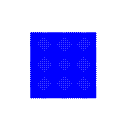
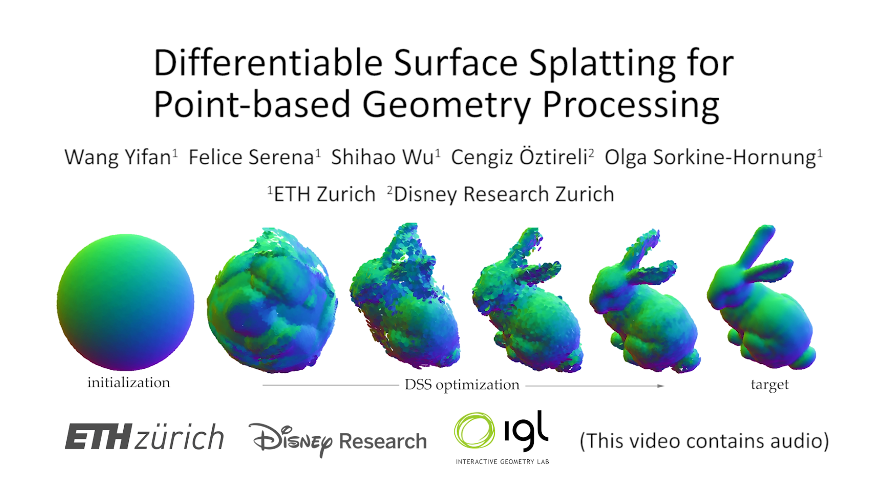

# DSS: Differentiable Surface Splatting
| [Arxiv](https://arxiv.org/abs/1906.04173) | [Project page](https://igl.ethz.ch/projects/differentiable-surface-splatting/) |
| ----------------------------------------- | ------------------------------------------------------------------------------ |


code for paper Differentiable Surface Splatting for Point-based Geometry Processing

- [DSS: Differentiable Surface Splatting](#dss-differentiable-surface-splatting)
  - [installation](#installation)
  - [Demos](#demos)
      - [inverse rendering - shape deformation](#inverse-rendering---shape-deformation)
        - [2D grid to teapot](#2d-grid-to-teapot)
        - [sphere to teapot](#sphere-to-teapot)
        - [cube to yoga](#cube-to-yoga)
      - [denoising](#denoising)
    - [other functions](#other-functions)
      - [render object 360 degree](#render-object-360-degree)
  - [video](#video)
  - [cite](#cite)


## installation
1. clone
````bash
git clone --recursive https://gitlab.inf.ethz.ch/OU-SORKINE/dss.git
cd dss
````
2. install prequisitories. Our code uses python3.7, the installation instruction requires the latest anaconda.
````bash
# install cuda, cudnn, nccl from nvidia
# we tested with cuda 10.1, cudnn 7.5, nccl 1.3.5
# update conda
conda update -n base -c defaults conda
# install requirements
conda config --add channels pytorch
conda config --add channels conda-forge
conda create --name DSS --file requirements.txt
conda activate DSS
# plyfile package is not on conda
pip install plyfile
````
3. compile cuda library
````bash
cd pytorch_points
python setup.py install
cd ..
python setup.py develop
````
## Demos

#### inverse rendering - shape deformation
##### 2D grid to teapot
```bash
python learn_shape_from_target.py -t example_data/scenes/good_teapot.json
```

##### sphere to teapot
````bash
# inverse rendering test: optimize point positions and normals to transform sphere to teapot
python learn_shape_from_target.py example_data/scenes/sphere.json -t example_data/scenes/teapot.json
````

##### cube to yoga
```bash
python learn_shape_from_target.py example_data/scenes/cube_20k.json  -t example_data/scenes/yoga6.json --name yoga6_z_paper_1
````

```bash
python finetune_shape.py learn_examples/yoga6_z_paper_1/final_scene.json  -t example_data/scenes/yoga6.json --name yoga6_z_paper_1_1
```


#### denoising
```bash
cd trained_models
# unix system can run this command directly
./download_data.sh
```
```bash
# 0.3% noise
python learn_image_filter.py example_data/scenes/pix2pix_denoise.json --cloud example_data/pointclouds/noisy03_points/a72-seated_jew_aligned_pca.ply
````


```bash
# 1.0% noise
python learn_image_filter.py example_data/scenes/pix2pix_denoise_noise01.json --cloud example_data/noisy1_points/a72-seated_jew_aligned_pca.ply
```


### other functions
#### render object 360 degree
```bash
python sequences.py example_data/scenes/teapot.json --points example_data/pointclouds/teapot_normal_dense.ply --width 512 --height 512 --output renders/teapot_360
# then you can create gif. on ubuntu this can be done with
convert -dispose 2 -delay 10 renders/teapot_360/*.png renders/teapot_360/animation.gif
```


## video
[](https://youtu.be/gqI0BoVVDzY "Accompanying video")
<!-- [Accompanying video](https://youtu.be/gqI0BoVVDzY) -->

## cite
Please cite us if you find the code useful!
```
@article{Yifan:DSS:2019,
author = {Wang Yifan and Felice Serena and 
        Shihao Wu and
        Cengiz {\"{O}}ztireli and
        Olga Sorkine{-}Hornung},
title = {Differentiable Surface Splatting for Point-based Geometry Processing},
journal = {ACM Transactions on Graphics (proceedings of ACM SIGGRAPH ASIA)},
volume = {38},
number = {6},
year = {2019},
}
``` 

