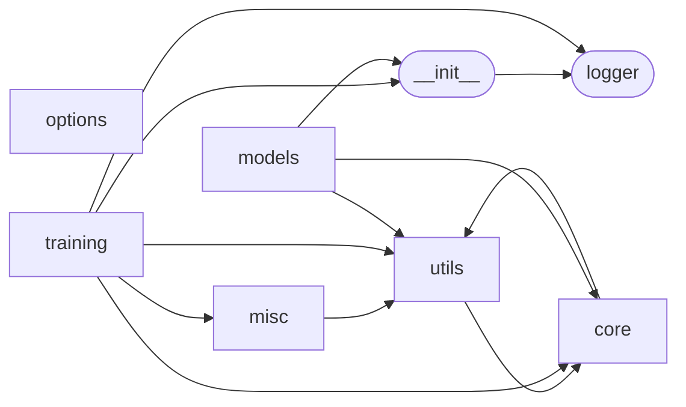

# Code Overview

[_Documentation generated by Documatic_](https://www.documatic.com)

<!---Documatic-section-Codebase Structure Python-start--->
## Codebase Structure Python

The codebase has a 3-deep folder structure,
                with 45 code files in total.

<!---Documatic-block-system_architecture-start--->

<!---Documatic-block-system_architecture-end--->

# #
<!---Documatic-section-Codebase Structure Python-end--->

<!---Documatic-section-Key Objects-start--->
## Key Objects

There are exposed imports at level-0
from the source directory (DSS)

<!---Documatic-block-DSS-start--->

	
<code>DSS</code> (Click to Expand!)

* `DSS.logger.get_logger`

<!---Documatic-block-DSS-end--->

# #
<!---Documatic-section-Key Objects-end--->

<!---Documatic-section-Important Functions-start--->
## Important Functions

<!---Documatic-block-important_funcs-start--->
<!---Documatic-block-most_used_funcs-start--->
### Most Utilised Functions

* DSS.utils.mathHelper.eps_denom (5 times)
* DSS.utils.mathHelper.decompose_to_R_and_t (3 times)
* DSS.__init__.get_debugging_tensor (3 times)
* DSS.logger.get_logger (2 times)
* DSS.utils.mathHelper.estimate_pointcloud_local_coord_frames (2 times)
* DSS.utils.mathHelper.estimate_pointcloud_normals (2 times)
* DSS.utils.__init__.gather_batch_to_packed (2 times)
* DSS.utils.__init__.get_class_from_string (2 times)
* DSS.__init__.get_debugging_mode (2 times)
* DSS.utils.mathHelper.ndc_to_pix (1 times)
* DSS.utils.__init__.get_grid_uniform (1 times)
* DSS.misc.pix2pix.data.__init__.create_dataset (1 times)
* DSS.misc.pix2pix.models.__init__.create_model (1 times)
* DSS.misc.pix2pix.data.base_dataset.get_transform (1 times)
* DSS.utils.__init__.mask_from_padding (1 times)
* DSS.utils.io.save_ply (1 times)
* DSS.utils.__init__.gather_with_neg_idx (1 times)
* DSS.utils.__init__.get_per_point_visibility_mask (1 times)
* DSS.utils.__init__.num_points_2_cloud_to_packed_first_idx (1 times)
* DSS.utils.mathHelper.eps_sqrt (1 times)
* DSS.utils.mathHelper.to_homogen (1 times)
* DSS.utils.__init__.valid_value_mask (1 times)
* DSS.utils.mathHelper.normalize (1 times)
* DSS.__init__.set_debugging_mode_ (1 times)
* DSS.utils.__init__.slice_dict (1 times)
<!---Documatic-block-most_used_funcs-end--->

<!---Documatic-block-end_user_funcs-start--->
### End User Exposed Functions

* DSS.logger.get_logger
* DSS.__init__.set_deterministic_
* DSS.__init__.set_debugging_mode_
* DSS.__init__.get_debugging_mode
* DSS.__init__.get_debugging_tensor
* DSS.__init__.DebuggingTensor
<!---Documatic-block-end_user_funcs-end--->
<!---Documatic-block-important_funcs-end--->

# #
<!---Documatic-section-Important Functions-end--->

<!---Documatic-section-File IO-start--->
## File IO

<!---Documatic-block-file_io-start--->
The following files have file read operations

<!---Documatic-block-DSS.misc-start--->

	
<code>DSS.misc</code> (Click to Expand!)

* DSS.misc.pix2pix.util.util

<!---Documatic-block-DSS.misc-end--->

<!---Documatic-block-DSS.options-start--->

	
<code>DSS.options</code> (Click to Expand!)

* DSS.options.deformation_options
* DSS.options.filter_options
* DSS.options.finetune_options
* DSS.options.render_options

<!---Documatic-block-DSS.options-end--->

The following files have file write operations

<!---Documatic-block-DSS.misc-start--->

	
<code>DSS.misc</code> (Click to Expand!)

* DSS.misc.pix2pix.util.html
* DSS.misc.visualize

<!---Documatic-block-DSS.misc-end--->
<!---Documatic-block-file_io-end--->

# #
<!---Documatic-section-File IO-end--->

<!---Documatic-section-Class Hierarchy-start--->
## Class Hierarchy

<!---Documatic-block-ABC-start--->

	
<code>ABC</code> (Click to Expand!)

* DSS.misc.pix2pix.data.base_dataset.BaseDataset
* DSS.misc.pix2pix.models.base_model.BaseModel

<!---Documatic-block-ABC-end--->

<!---Documatic-block-DSS.misc.pix2pix.data.base_dataset.BaseDataset-start--->

	
<code>DSS.misc.pix2pix.data.base_dataset.BaseDataset</code> (Click to Expand!)

* DSS.misc.pix2pix.data.aligned_dataset.AlignedDataset
* DSS.misc.pix2pix.data.single_dataset.SingleDataset

<!---Documatic-block-DSS.misc.pix2pix.data.base_dataset.BaseDataset-end--->

<!---Documatic-block-DSS.misc.pix2pix.models.base_model.BaseModel-start--->

	
<code>DSS.misc.pix2pix.models.base_model.BaseModel</code> (Click to Expand!)

* DSS.misc.pix2pix.models.pix2pix_model.Pix2PixModel
* DSS.misc.pix2pix.models.template_model.TemplateModel

<!---Documatic-block-DSS.misc.pix2pix.models.base_model.BaseModel-end--->

<!---Documatic-block-DSS.training.losses.SurfaceLoss-start--->

	
<code>DSS.training.losses.SurfaceLoss</code> (Click to Expand!)

* DSS.training.losses.ProjectionLoss
* DSS.training.losses.RepulsionLoss

<!---Documatic-block-DSS.training.losses.SurfaceLoss-end--->

<!---Documatic-block-data.Dataset-start--->

	
<code>data.Dataset</code> (Click to Expand!)

* DSS.misc.pix2pix.data.base_dataset.BaseDataset
* DSS.utils.dataset.MVRDataset

<!---Documatic-block-data.Dataset-end--->

# #
<!---Documatic-section-Class Hierarchy-end--->

[_Documentation generated by Documatic_](https://www.documatic.com)