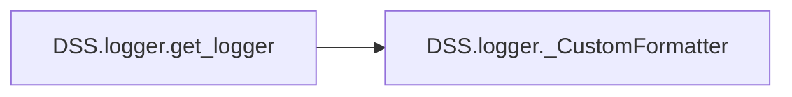

# Dss Logger

[_Documentation generated by Documatic_](https://www.documatic.com)

<!---Documatic-section-Codebase Structure-start--->
## Codebase Structure

<!---Documatic-block-system_architecture-start--->
```mermaid
None
```
<!---Documatic-block-system_architecture-end--->

# #
<!---Documatic-section-Codebase Structure-end--->

<!---Documatic-section-DSS.logger.get_logger-start--->
## DSS.logger.get_logger

<!---Documatic-section-get_logger-start--->


### Object Calls

* DSS.logger._CustomFormatter

<!---Documatic-block-DSS.logger.get_logger-start--->
<details>
	<summary><code>DSS.logger.get_logger</code> code snippet</summary>

```python
def get_logger(name):
    logger = logging.getLogger(name)
    logger.setLevel(logging.DEBUG)
    ch = logging.StreamHandler()
    ch.setLevel(logging.DEBUG)
    ch.setFormatter(_CustomFormatter())
    logger.addHandler(ch)
    return logger
```
</details>
<!---Documatic-block-DSS.logger.get_logger-end--->
<!---Documatic-section-get_logger-end--->

# #
<!---Documatic-section-DSS.logger.get_logger-end--->

<!---Documatic-section-DSS.logger._CustomFormatter-start--->
## DSS.logger._CustomFormatter

<!---Documatic-section-_CustomFormatter-start--->
<!---Documatic-block-DSS.logger._CustomFormatter-start--->
<details>
	<summary><code>DSS.logger._CustomFormatter</code> code snippet</summary>

```python
class _CustomFormatter(logging.Formatter):
    grey = '\x1b[0;37m'
    green = '\x1b[1;32m'
    yellow = '\x1b[1;33m'
    red = '\x1b[1;31m'
    purple = '\x1b[1;35m'
    blue = '\x1b[1;34m'
    light_blue = '\x1b[1;36m'
    reset = '\x1b[0m'
    blink_red = '\x1b[5m\x1b[1;31m'
    format_prefix = f'{purple}%(asctime)s{reset} {blue}%(name)s{reset} {light_blue}(%(filename)s:%(lineno)d){reset} '
    format_suffix = '%(levelname)s - %(message)s'
    FORMATS = {logging.DEBUG: format_prefix + green + format_suffix + reset, logging.INFO: format_prefix + grey + format_suffix + reset, logging.WARNING: format_prefix + yellow + format_suffix + reset, logging.ERROR: format_prefix + red + format_suffix + reset, logging.CRITICAL: format_prefix + blink_red + format_suffix + reset}

    def format(self, record):
        log_fmt = self.FORMATS.get(record.levelno)
        formatter = logging.Formatter(log_fmt)
        return formatter.format(record)
```
</details>
<!---Documatic-block-DSS.logger._CustomFormatter-end--->
<!---Documatic-section-_CustomFormatter-end--->

# #
<!---Documatic-section-DSS.logger._CustomFormatter-end--->

[_Documentation generated by Documatic_](https://www.documatic.com)