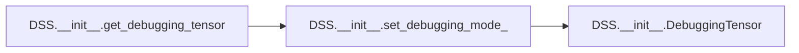
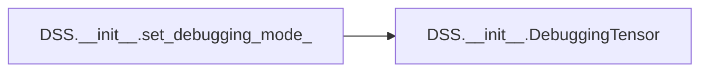

# Dss Init

[_Documentation generated by Documatic_](https://www.documatic.com)

<!---Documatic-section-Codebase Structure-start--->
## Codebase Structure

<!---Documatic-block-system_architecture-start--->

<!---Documatic-block-system_architecture-end--->

# #
<!---Documatic-section-Codebase Structure-end--->

<!---Documatic-section-DSS.__init__.get_debugging_tensor-start--->
## DSS.__init__.get_debugging_tensor

<!---Documatic-section-get_debugging_tensor-start--->


### Object Calls

* DSS.__init__.set_debugging_mode_

<!---Documatic-block-DSS.__init__.get_debugging_tensor-start--->
<details>
	<summary><code>DSS.__init__.get_debugging_tensor</code> code snippet</summary>

```python
def get_debugging_tensor():
    if _debugging_tensor is None:
        logger_py.warning('Attempt to get debugging tensor before setting debugging mode to true.')
        set_debugging_mode_(True)
    return _debugging_tensor
```
</details>
<!---Documatic-block-DSS.__init__.get_debugging_tensor-end--->
<!---Documatic-section-get_debugging_tensor-end--->

# #
<!---Documatic-section-DSS.__init__.get_debugging_tensor-end--->

<!---Documatic-section-DSS.__init__.get_debugging_mode-start--->
## DSS.__init__.get_debugging_mode

<!---Documatic-section-get_debugging_mode-start--->
<!---Documatic-block-DSS.__init__.get_debugging_mode-start--->
<details>
	<summary><code>DSS.__init__.get_debugging_mode</code> code snippet</summary>

```python
def get_debugging_mode():
    return _debug
```
</details>
<!---Documatic-block-DSS.__init__.get_debugging_mode-end--->
<!---Documatic-section-get_debugging_mode-end--->

# #
<!---Documatic-section-DSS.__init__.get_debugging_mode-end--->

<!---Documatic-section-DSS.__init__.set_debugging_mode_-start--->
## DSS.__init__.set_debugging_mode_

<!---Documatic-section-set_debugging_mode_-start--->


### Object Calls

* DSS.__init__.DebuggingTensor

<!---Documatic-block-DSS.__init__.set_debugging_mode_-start--->
<details>
	<summary><code>DSS.__init__.set_debugging_mode_</code> code snippet</summary>

```python
def set_debugging_mode_(is_debug, *args, **kwargs):
    global _debugging_tensor, _debug
    _debug = is_debug
    if _debug:
        _debugging_tensor = DebuggingTensor(*args, **kwargs)
        logger_py.info('Enabled debugging mode.')
    else:
        _debugging_tensor = None
```
</details>
<!---Documatic-block-DSS.__init__.set_debugging_mode_-end--->
<!---Documatic-section-set_debugging_mode_-end--->

# #
<!---Documatic-section-DSS.__init__.set_debugging_mode_-end--->

<!---Documatic-section-DSS.__init__.set_deterministic_-start--->
## DSS.__init__.set_deterministic_

<!---Documatic-section-set_deterministic_-start--->
<!---Documatic-block-DSS.__init__.set_deterministic_-start--->
<details>
	<summary><code>DSS.__init__.set_deterministic_</code> code snippet</summary>

```python
def set_deterministic_():
    torch.manual_seed(0)
    torch.backends.cudnn.deterministic = True
    torch.backends.cudnn.benchmark = False
    np.random.seed(0)
```
</details>
<!---Documatic-block-DSS.__init__.set_deterministic_-end--->
<!---Documatic-section-set_deterministic_-end--->

# #
<!---Documatic-section-DSS.__init__.set_deterministic_-end--->

<!---Documatic-section-DSS.__init__.DebuggingTensor-start--->
## DSS.__init__.DebuggingTensor

<!---Documatic-section-DebuggingTensor-start--->
<!---Documatic-block-DSS.__init__.DebuggingTensor-start--->
<details>
	<summary><code>DSS.__init__.DebuggingTensor</code> code snippet</summary>

```python
class DebuggingTensor:
    __slots__ = ['pts_world', 'pts_world_grad', 'img_mask_grad']

    def __init__(self):
        self.pts_world = OrderedDict()
        self.pts_world_grad = OrderedDict()
        self.img_mask_grad = OrderedDict()
```
</details>
<!---Documatic-block-DSS.__init__.DebuggingTensor-end--->
<!---Documatic-section-DebuggingTensor-end--->

# #
<!---Documatic-section-DSS.__init__.DebuggingTensor-end--->

[_Documentation generated by Documatic_](https://www.documatic.com)